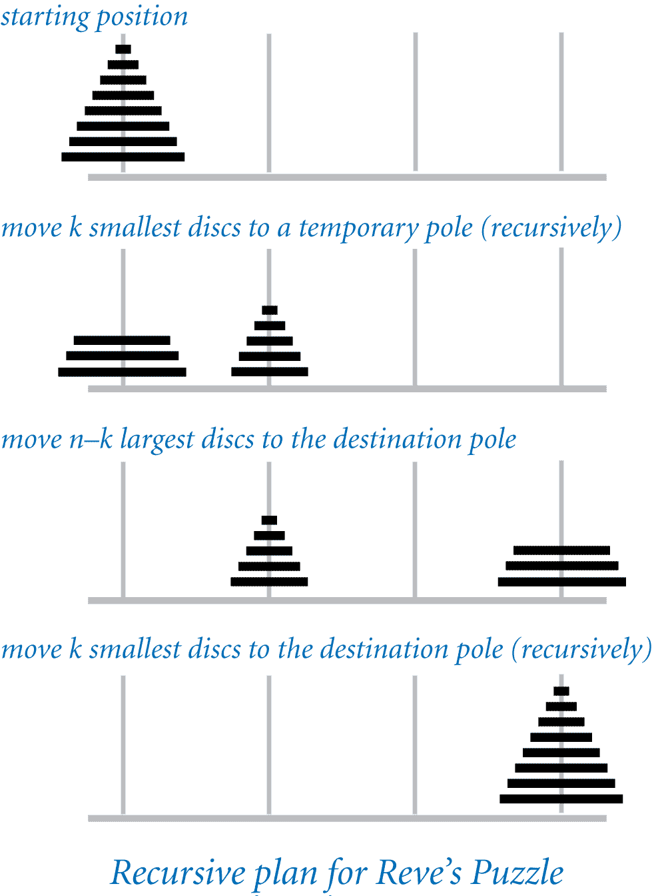

# Reve's Puzzle Solution in Java

## 📌 Overview  
Reve’s Puzzle (also called the **Frame-Stewart Algorithm**) is a four-peg variation of the **Tower of Hanoi** problem. The goal is to move a set of disks from one peg to another using four pegs, following the usual rules:  
- Only one disk can be moved at a time.  
- A larger disk cannot be placed on a smaller one.  

Unlike the Tower of Hanoi (which has an exact formula for the minimum moves), Reve’s Puzzle requires **Frame-Stewart’s recursive algorithm**, which provides a more efficient solution.

## 📖 Frame-Stewart Algorithm  
The following **remarkable algorithm**, discovered by **Frame and Stewart in 1941**, transfers `N` discs from the starting pole to the destination pole using the **fewest moves** (although this was not mathematically proven until **2014**).  

### 🔢 Algorithm Breakdown
1. Let **k** be the integer nearest to:  

k = ⌊ N + 1 - 2√(N+1) ⌋

2. **Step 1**: Move the **k smallest discs** to an intermediate peg (not the start or destination).  
3. **Step 2**: Move the **remaining N - k discs** to the destination peg using the **three-peg Tower of Hanoi algorithm** (without using the peg that now contains the smallest `k` discs).  
4. **Step 3**: Move the **k smallest discs** from the intermediate peg to the destination peg.  

This strategy significantly reduces the total number of moves compared to the standard Tower of Hanoi approach.  

## 🖼️ Diagram
Here’s a visual representation of the **Reve’s Puzzle** process:  

  

## ⚡ Features
- Implements the **Frame-Stewart algorithm** for optimal moves.  
- Uses **recursion** to break the problem into smaller subproblems.  
- Efficient solution with reduced move count compared to the Tower of Hanoi.  
- Works for any number of disks (`N`).  

## 📂 File Structure

/reves-puzzle
│── RevesPuzzle.java      # Java implementation of Reve’s Puzzle
│── README.md             # Documentation (this file)
│── reves_puzzle_diagram.png # Diagram explaining the puzzle

## 🚀 How to Run
### 1️⃣ Clone the Repository  
```bash
git clone https://github.com/Abdullahon2006/reves-puzzle.git
cd reves-puzzle

2️⃣ Compile and Run

javac RevesPuzzle.java
java RevesPuzzle <number_of_disks>

Replace <number_of_disks> with the desired number of disks.

📌 Example Usage

java RevesPuzzle 4

💡 Expected Output: Step-by-step instructions for moving the disks.

📊 Time Complexity
	•	Tower of Hanoi (3 Pegs): O(2^N)
	•	Reve’s Puzzle (4 Pegs): O(N^(log₂ 3)) ≈ O(N^1.585)
Thus, Reve’s Puzzle is much more efficient than Tower of Hanoi for large N.

🤝 Contributing

Want to improve the solution? Fork the repo, make your changes, and submit a pull request! 🎉

📝 License

This project is open-source under the MIT License.
